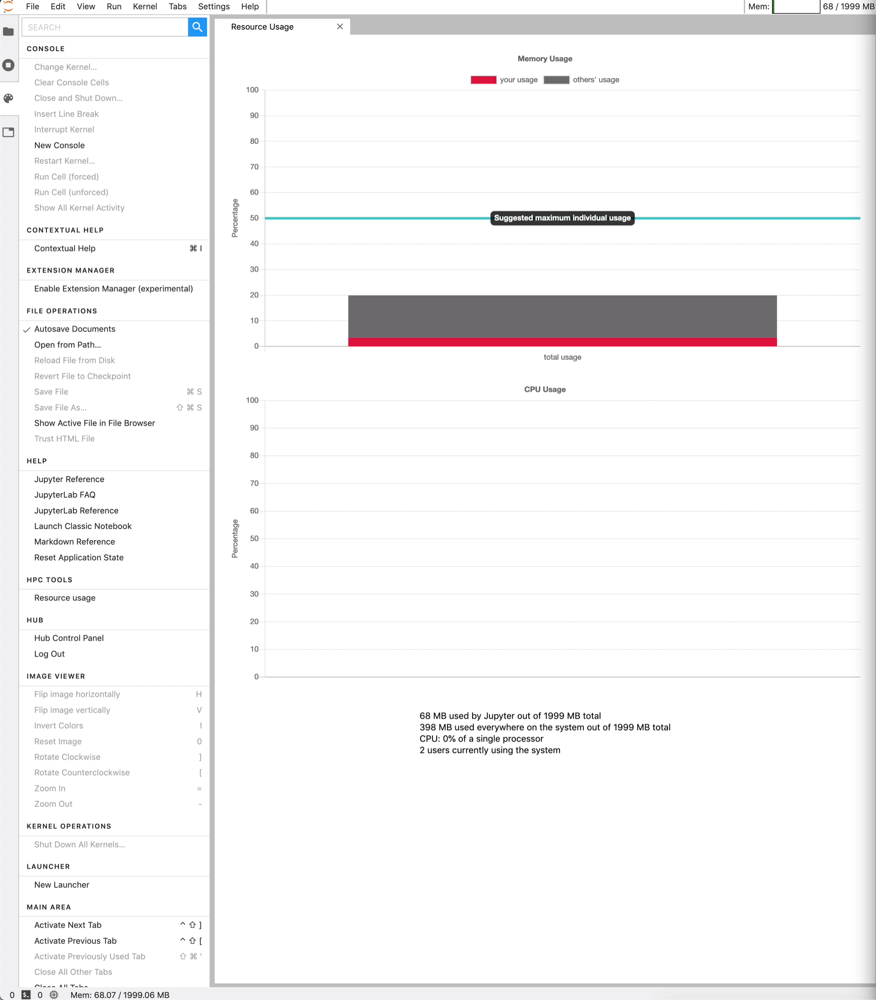

# Installation

No concise installation instructions available at the moment. Full Docker image (whose Dockerfiles contain installation instructions implicitly) can be found [here](https://github.com/krinsman/jupyterhub-deploy/tree/master/resuse), which you can test this locally. This is in part because it requires [my fork of nbresuse](https://github.com/yuvipanda/nbresuse/compare/master...krinsman:master) to run.

Here is a picture with a link to a YouTube video which demos the extension:

Basically a modification of [nbresuse](https://github.com/yuvipanda/nbresuse), with inspiration from [jupyterlab-slurm](https://github.com/NERSC/jupyterlab-slurm) (which I also contributed to). Chart.js documentation and [examples](https://www.chartjs.org/samples/latest/) were helpful as well.
